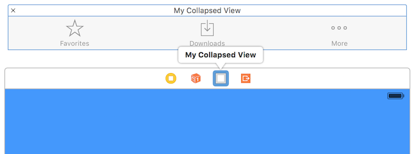

# BNSlidingViewController

[](https://github.com/bennagar/BNSlidingViewController)
[](https://github.com/bennagar/BNSlidingViewController)
[](https://github.com/bennagar/BNSlidingViewController)
[](https://github.com/bennagar/BNSlidingViewController)
[](https://twitter.com/codeletter)

BNSlidingViewController is a Swift controller mimics the player overlay in iTunes iOS app. Created by [Ben Nagar](http://twitter.com/bennagar).


## Requirements

- Xcode 7.2
- iOS 7.0+

## Installation

Just add BNSlidingViewController.swift to your project.

## Usage

1. Create your ```SlidingPanelViewController``` and make it implement ```Slidable``` protocol
  * ```collapsedView``` need to be your ViewController's view
  * ```expandedView``` need to be external view, NOT subview of you collapsedView (you can see easy way to do it in the demo project)

  

2. Create your ```MainViewController``` subclassing ```BNSlidingViewController```
  * in ```viewDidLoad()``` get your SlidingPanel and pass it to ```setup()```

3. you can override this method in your ```MainViewController``` to handle state changes
``` swift
  override func didChangeState(newState: SliderState) {
      super.didChangeState(newState)
      //change you view according to the new state
  }
```

## License
BNSlidingViewController is available under the MIT license. See the LICENSE file for more info.

Follow on Twitter [✨CodeLetter ✎ ✨](http://twitter.com/codeletter)  [](https://twitter.com/codeletter)
